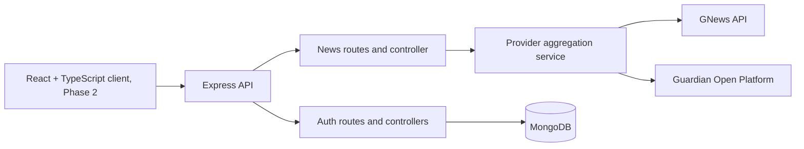

# News Aggregator

A news aggregation API that searches GNews and The Guardian Open Platform, normalizes their articles into one response format, and provides user registration and login.

## Architecture



The API keys stay on the server. The news service calls each configured provider concurrently, normalizes results, removes duplicate URLs, and returns partial results if one provider is unavailable. Node 20 or newer is recommended; the current Node built-in `fetch` avoids an extra HTTP-client dependency.

## Current project files

```text
.
├── app.js
├── server.js
├── package.json
├── .env.example
├── README.md
└── src/
    ├── config/
    │   ├── database.js
    │   └── env.js
    ├── controllers/
    │   ├── authController.js
    │   └── newsController.js
    ├── middleware/
    │   ├── authMiddleware.js
    │   └── errorMiddleware.js
    ├── models/
    │   └── User.js
    ├── routes/
    │   ├── authRoutes.js
    │   └── newsRoutes.js
    └── services/
        └── newsService.js
```

## Setup

1. Install Node.js 20 or newer and MongoDB Community Server, or create a MongoDB Atlas database.
2. From the project root, install dependencies:

   ```powershell
   npm install
   ```

3. Copy `.env.example` to `.env` and fill in `MONGODB_URI`, `JWT_SECRET`, and at least one news API key. Get keys from [GNews](https://gnews.io/) and [The Guardian Open Platform](https://open-platform.theguardian.com/).
4. Start the API:

   ```powershell
   npm run dev
   ```

The API listens on `http://localhost:5000`. Never commit `.env` or expose provider keys in a browser application.

## API

- `GET /api/v1/health` checks that the API process is responding.
- `GET /api/v1/news?q=climate&pageSize=10&from=2026-09-01&to=2026-09-30` searches configured providers. `q` is required (at least 2 characters); `pageSize` is clamped to 1-50. Date filters are optional.
- `POST /api/v1/auth/register` accepts `{ "name": "Ada", "email": "ada@example.com", "password": "a-long-password" }`.
- `POST /api/v1/auth/login` accepts `{ "email": "ada@example.com", "password": "a-long-password" }`.

News responses contain `data.articles` with a consistent article shape and `data.providers` with successful and failed provider names. At least one provider key must be configured.

## Dependencies

Runtime dependencies are Express 5, Mongoose, bcryptjs, jsonwebtoken, dotenv, Helmet, and CORS. Nodemon is used for development. No separate HTTP client is needed on Node 20+.

## Delivery phases

1. **Backend foundation and provider search (current):** one app/server entry point, environment configuration, health endpoint, registration/login, normalized GNews + Guardian search, and this setup guide.
2. **Frontend:** add a React + TypeScript + Vite client, typed API client, search/filter experience, responsive article results, and loading/empty/error states. Keep UI dependencies lean; add React Router only when navigation needs more than one view.
3. **Personalization:** add authenticated saved articles and user preferences, including a MongoDB model, ownership checks, and API endpoints.
4. **Quality and production readiness:** add API and service tests, request validation/rate limits, structured logging, API documentation, deployment configuration, and CI checks.

We can review each phase before moving on. The current phase does not create a frontend or saved-article storage yet.