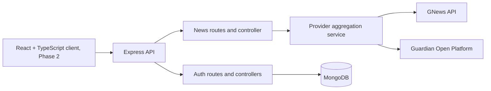

# News Aggregator

A news aggregation API that searches GNews and The Guardian Open Platform, normalizes their articles into one response format, and provides user registration and login.

## Architecture



The API keys stay on the server. The news service calls each configured provider concurrently, normalizes results, removes duplicate URLs, and returns partial results if one provider is unavailable. Node 20 or newer is recommended; the current Node built-in `fetch` avoids an extra HTTP-client dependency.

## Current project files

```text
.
├── app.js
├── server.js
├── package.json
├── .env.example
├── README.md
└── src/
    ├── config/
    │   ├── database.js
    │   └── env.js
    ├── controllers/
    │   ├── authController.js
    │   └── newsController.js
    ├── middleware/
    │   ├── authMiddleware.js
    │   └── errorMiddleware.js
    ├── models/
    │   └── User.js
    ├── routes/
    │   ├── authRoutes.js
    │   └── newsRoutes.js
    └── services/
        └── newsService.js
```

## Setup

1. Install Node.js 20 or newer and MongoDB Community Server, or create a MongoDB Atlas database.
2. From the project root, install dependencies:

   ```powershell
   npm install
   ```

3. Copy `.env.example` to `.env` and fill in `MONGODB_URI`, `JWT_SECRET`, and at least one news API key. Get keys from [GNews](https://gnews.io/) and [The Guardian Open Platform](https://open-platform.theguardian.com/).
4. Start the API:

   ```powershell
   npm run dev
   ```

The API listens on `http://localhost:5000`. Never commit `.env` or expose provider keys in a browser application.

## API

- `GET /api/v1/health` checks that the API process is responding.
- `GET /api/v1/news?q=climate&pageSize=10&from=2026-09-01&to=2026-09-30&country=gb` searches configured providers. `q` is required (at least 2 characters); `pageSize` is clamped to 1-50. Date and GNews country filters are optional. When a country is selected, only GNews is queried because The Guardian search endpoint does not support the same country filter.
- `GET /api/v1/news/filters` returns the editorial sections and country codes supported by this application.
- `GET /api/v1/news/headlines?category=business&country=gb&page=1&pageSize=10` requests GNews top headlines. Supported categories are `general`, `world`, `nation`, `business`, `technology`, `entertainment`, `sports`, `science`, and `health`; supported country codes are returned by `/api/v1/news/filters`. The response includes GNews pagination metadata.
- `GET /api/v1/news/sections/:section?country=gb&page=1&pageSize=10` returns a configured TheFeeds section. Native GNews categories use top headlines; editorial sections without a native GNews category use a documented keyword search instead.
- `POST /api/v1/auth/register` accepts `{ "name": "Ada", "email": "ada@example.com", "password": "a-long-password" }`.
- `POST /api/v1/auth/login` accepts `{ "email": "ada@example.com", "password": "a-long-password" }`.

News responses contain `data.articles` with a consistent article shape and `data.providers` with successful and failed provider names. At least one provider key must be configured.

The application-level sections `art`, `travel`, `audio`, `video`, and `live` are keyword searches, not GNews media-format/category filters. `culture` maps to GNews `entertainment`, and `earth` maps to GNews `science`.

## Dependencies

Runtime dependencies are Express 5, Mongoose, bcryptjs, jsonwebtoken, dotenv, Helmet, and CORS. Nodemon is used for development. No separate HTTP client is needed on Node 20+.

## Delivery phases

1. **Backend foundation and provider search:** health endpoint, registration/login, normalized GNews + Guardian search, category headline/section routes, and country filter metadata.
2. **Frontend:** React + TypeScript + Vite client with category navigation, country edition selection, news search, source-linked article summaries, and auth forms.
3. **Personalization:** authenticated saved articles and user preferences, including a MongoDB model, ownership checks, and API endpoints.
4. **Quality and production readiness:** expand API and service tests, request validation/rate limits, structured logging, deployment configuration, and CI checks.

The frontend must not display bookmarks, personal feeds, or preferences as working features until their backend endpoints and contracts are implemented.

GNews references: [Top Headlines endpoint](https://docs.gnews.io/endpoints/top-headlines-endpoint) and [Search endpoint](https://docs.gnews.io/endpoints/search-endpoint).